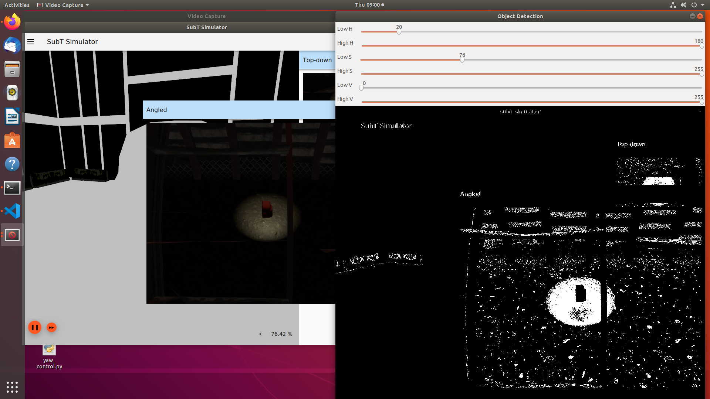
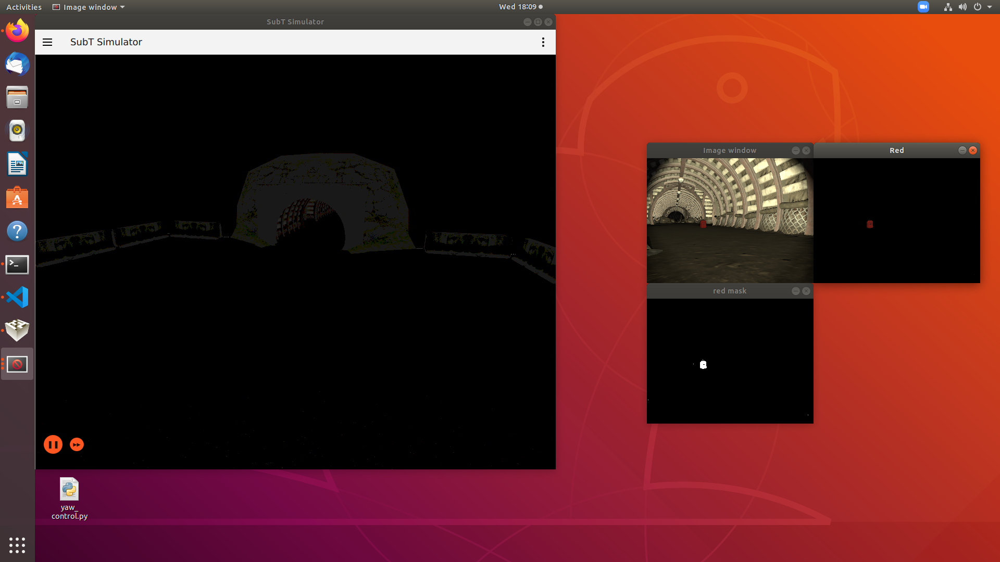

# ROS Package - simple_detect

The simple_detect package includes programs to aid in detecting objects. It is currently in development to use non-machine learning capabilities of opencv.


## hsv_sliders.py

Description: Thresholding Operations using inRange and the HSV color space

The OpenCV inRange function applies upper and lower boundary values to the source image pixels. The pixels within this range are set to 255. Pixels outside the range are set to 0.

The program works with either camera input or still image input. For camera input, uncomment the line `ret, frame = cap.read()` and comment out the section starting at `path = ` through `print('imread failure')` in the try except block.

When working with a still image, change the path to the location of your still image.

```
while True:

    # Uncomment the line below for camera input
    #ret, frame = cap.read()
    
    
    # To use with a single still image, uncomment this section.
    # Change the path to your image path.
    
    path = '../images/angled_backpack1.png'

    try:
        # Reading an image in default mode 
        frame = cv.imread(path)
    except cv.error as e:
        print('imread failure') 
```

<br><br>

### Program execution

Does not require ros or the subt simulator. This is a stand-alone python program.


```python hsv_sliders.py```

<br>


### Program output

The image below was generated by moving the sliders. Note that the maximum value of the Hue slider is 180, due to the way OpenCV represents the HSV color space.<br><br><br>



<br>
<br>

> The source code is copied directly from the OpenCV tutorial: https://docs.opencv.org/3.4/da/d97/tutorial_threshold_inRange.html 


<br>
<br>


## test_backpack_blob.py

This program uses OpenCV SimpleBlobDetector to detect a red backpack. Use it to experiment with the inRange filter thresholds and blob detection parameters. Currently, the test image name is hard-coded in the program. A future update will allow passing the image name(s) via the command line.

Program execution: `python test_backpack_blob.py`

<br>

**Program output:** Displays the orginal image, the mask image, the inRange filtered image, and the image with blob keypoints as green circles. Writes a message indicating number of blobs found. 


<br><br><br>

## backpack_blob_circularity.py

Calculates values for the blob detection circularity parameter setting. The backpack dimensions were found on the Jansport website. Provides output for top view, side view, and front view. The circularity formula is given in the OpenCV documentation.


<br><br>

## backpack_blob_detect.py

This program may be run with any of the simulation worlds. The backpack_params.yaml is currently hard-coded to /X1/front/image_raw video stream. This will be changed shortly, to allow an argument or parameter to be passed for any of the robots and other camera names.

The program uses the inRange filter to search for the red color in an attempt to identify the red backpack. See the ToDo list below for planned updates to the source code.

#### Program Execution

Start the subt simulation with any of the practice worlds and then run the python program.

```
source ~/subt_ws/install/setup.bash
ign launch -v 4 tunnel_circuit_practice.ign worldName:=tunnel_circuit_practice_01 robotName1:=X1 robotConfig1:=X1_SENSOR_CONFIG_1
```

```
source ~/catkin_ws/devel/setup.bash
roslaunch simple_detect backpack_detect.launch
```

<br>

> Note: The following error appears when running the program, but does not seem to affect performance. I have not yet investigated the cause.

```
[ERROR] [1592496706.796787]: Unexpected error during statistics measurement: time is not initialized. Have you called init_node()?
```
<br><br>

#### Test results, 6/17/20

The color filter did appear to detect the red backpack in tunnel practice 1. An example image is shown below. 



<br><br>

#### ToDo
- Add blob detection
- Use depth image stream to estimate blob pixel locations relative to robot
- Add artifact report
- Test, accumulate data to see how well backpack is detected